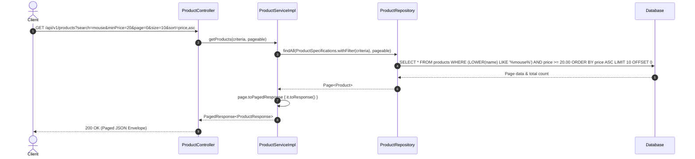

# Day 02: REST Principles & Dynamic Queries

Welcome to **Day 02** of the Spring Boot with Kotlin Master Course! Today, we evolve **ShopCraft** from a basic CRUD service into an enterprise-grade, RESTful API featuring complete HTTP verb semantics, idempotent operations, Spring Data pagination, and type-safe dynamic query specifications.

---

## 🎯 Learning Objectives

By the end of this module, you will be able to:
1. **Master REST Architectural Constraints**: Articulate and enforce client-server separation, statelessness, uniform interfaces, and proper URI hierarchy.
2. **Implement Full HTTP Semantics**:
   - `PUT`: Complete idempotent resource replacement returning `200 OK`.
   - `PATCH`: Selective partial attribute modification returning `200 OK`.
   - `DELETE`: Idempotent resource removal returning `204 No Content` with an empty response body.
3. **Differentiate Safe vs. Idempotent Methods**: Understand why `PUT` and `DELETE` must be idempotent, while `POST` is not.
4. **Standardize API Responses**: Wrap paginated results into a clean, decoupled generic envelope (`PagedResponse<T>`).
5. **Build Dynamic Queries with JPA Specifications**: Use Spring Data's `JpaSpecificationExecutor` and Kotlin `Specification<Product>` predicates to construct dynamic database queries on demand.
6. **Apply Given-When-Then BDD Testing**: Verify REST endpoints and database specifications using comprehensive slice and unit tests.

---

## 🧠 Core Theory & Deep Dive

### 1. The Core Constraints of REST

Representational State Transfer (REST) is an architectural style defined by Roy Fielding. It relies on 6 core constraints:
1. **Client-Server**: Separation of concerns between the user interface (client) and data storage/business logic (server).
2. **Statelessness**: Every client request must contain all necessary context for the server to process it. The server stores no client session context between requests.
3. **Cacheability**: Responses must explicitly label themselves as cacheable or non-cacheable to improve network efficiency.
4. **Uniform Interface**: Resources are identified by standard URIs, manipulated through standardized representations (JSON), and self-descriptive messages.
5. **Layered System**: The client cannot tell whether it is connected directly to the end server or an intermediary (CDN, reverse proxy, API gateway).
6. **Code on Demand (Optional)**: Servers can temporarily extend client functionality by transferring executable code (e.g. JavaScript).

---

### 2. HTTP Method Semantics: Safe vs. Idempotent

| HTTP Method | Safe? | Idempotent? | RFC Semantics & Status Code |
| :--- | :--- | :--- | :--- |
| **`GET`** | **Yes** | **Yes** | Retrieves representation without modifying state. Returns `200 OK` or `404 Not Found`. |
| **`POST`** | No | No | Creates a subordinate resource. Returns `201 Created` with standard RFC `Location` header. |
| **`PUT`** | No | **Yes** | **Complete replacement** of the target resource. Calling `PUT` multiple times with the same payload results in the exact same server state. Returns `200 OK`. |
| **`PATCH`** | No | Conditional | **Partial modification** of specific attributes. Applies a set of changes to the resource. Returns `200 OK`. |
| **`DELETE`** | No | **Yes** | Removes the resource. Calling `DELETE` once deletes the resource; calling it again leaves the resource deleted (the end state is identical). Returns `204 No Content`. |

> **Key Takeaway on `204 No Content`**:
> An HTTP `204 No Content` response **MUST NOT** include a message-body. In Spring MVC, we return `ResponseEntity.noContent().build()` with type parameter `Void`.

---

### 3. PUT vs. PATCH: The Architectural Distinction

A major anti-pattern in modern backend development is treating `PUT` as a partial update.

- **`PUT /api/v1/products/{id}` (Complete Replacement)**:
  The request body represents the **entire desired state** of the resource. Any mutable property omitted in the request is considered cleared or set to null/default.
  ```kotlin
  // In ProductServiceImpl.kt
  override fun updateProduct(id: Long, request: ProductRequest): ProductResponse {
      val product = productRepository.findByIdOrNull(id) ?: throw ProductNotFoundException(id)
      product.sku = request.sku
      product.name = request.name
      product.description = request.description
      product.price = request.price
      product.stockQuantity = request.stockQuantity
      product.status = request.status
      product.updatedAt = Instant.now()
      return productRepository.save(product).toResponse()
  }
  ```

- **`PATCH /api/v1/products/{id}` (Selective Partial Modification)**:
  The request body contains **only the fields to be changed**. All fields are nullable, and only non-null values update the underlying entity:
  ```kotlin
  // In ProductServiceImpl.kt
  override fun patchProduct(id: Long, request: ProductPatchRequest): ProductResponse {
      val product = productRepository.findByIdOrNull(id) ?: throw ProductNotFoundException(id)
      request.name?.let { product.name = it }
      request.description?.let { product.description = it }
      request.price?.let { product.price = it }
      request.stockQuantity?.let { product.stockQuantity = it }
      request.status?.let { product.status = it }
      product.updatedAt = Instant.now()
      return productRepository.save(product).toResponse()
  }
  ```

---

### 4. Standardizing Pagination: The `PagedResponse<T>` Envelope

Spring Data's `Page<T>` contains framework-specific metadata (e.g. `pageable`, `sort.empty`, `numberOfElements`). Exposing `Page<T>` directly leaks framework internals to API consumers.

We encapsulate paginated responses in an immutable generic envelope:
```kotlin
data class PagedResponse<T : Any>(
    val content: List<T>,
    val pageNumber: Int,
    val pageSize: Int,
    val totalElements: Long,
    val totalPages: Int,
    val isFirst: Boolean,
    val isLast: Boolean,
    val hasNext: Boolean,
    val hasPrevious: Boolean
)
```

With an idiomatic Kotlin extension function:
```kotlin
fun <T : Any, R : Any> Page<T>.toPagedResponse(transform: (T) -> R): PagedResponse<R> = PagedResponse(
    content = content.map(transform),
    pageNumber = number,
    pageSize = size,
    totalElements = totalElements,
    totalPages = totalPages,
    isFirst = isFirst,
    isLast = isLast,
    hasNext = hasNext(),
    hasPrevious = hasPrevious()
)
```

---

### 5. Dynamic Queries via `JpaSpecificationExecutor`

Real-world e-commerce APIs require searching by keyword, filtering by price ranges, filtering by stock status, and sorting—all optionally combinable.

Writing dozens of repository finder methods (`findByPriceBetweenAndStatus...`) quickly becomes unmaintainable. Instead, we use Spring Data JPA's `JpaSpecificationExecutor<T>`:

```kotlin
interface ProductRepository : JpaRepository<Product, Long>, JpaSpecificationExecutor<Product>
```

In `ProductSpecifications.kt`, we use the JPA Criteria API to build dynamic predicates conditionally:

```kotlin
object ProductSpecifications {
    fun withFilter(criteria: ProductFilterCriteria): Specification<Product> {
        return Specification { root, _, cb ->
            val predicates = mutableListOf<Predicate>()

            criteria.search?.takeIf { it.isNotBlank() }?.let { query ->
                val pattern = "%${query.trim().lowercase()}%"
                predicates.add(
                    cb.or(
                        cb.like(cb.lower(root.get("name")), pattern),
                        cb.like(cb.lower(root.get("description")), pattern)
                    )
                )
            }

            criteria.minPrice?.let { cb.greaterThanOrEqualTo(root.get("price"), it) }?.let(predicates::add)
            criteria.maxPrice?.let { cb.lessThanOrEqualTo(root.get("price"), it) }?.let(predicates::add)
            criteria.status?.let { cb.equal(root.get<ProductStatus>("status"), it) }?.let(predicates::add)

            criteria.inStock?.let { inStock ->
                if (inStock) cb.greaterThan(root.get("stockQuantity"), 0)
                else cb.equal(root.get<Int>("stockQuantity"), 0)
            }?.let(predicates::add)

            if (predicates.isEmpty()) cb.conjunction() else cb.and(*predicates.toTypedArray())
        }
    }
}
```

---

## 🏛️ REST Architecture & Request Flow



---

## 🔨 Step-by-Step Implementation Guide

If you are on the **`day-02-rest-principles-starter`** branch, follow these 10 steps:

### Step 1: Implement `toPagedResponse` in `PagedResponse.kt`
- File: `src/main/kotlin/com/example/shopcraft/common/model/PagedResponse.kt`
- Implement the `toPagedResponse` extension function on Spring Data `Page<T>` mapping elements to `R` and populating pagination metadata.

### Step 2: Implement `withFilter` in `ProductSpecifications.kt`
- File: `src/main/kotlin/com/example/shopcraft/product/repository/ProductSpecifications.kt`
- Construct dynamic JPA predicates for `search` (matching name or description case-insensitively), `minPrice`, `maxPrice`, `status`, and `inStock`.

### Step 3: Implement `updateProduct` in `ProductServiceImpl`
- File: `src/main/kotlin/com/example/shopcraft/product/service/ProductServiceImpl.kt`
- Retrieve entity by ID with `findByIdOrNull`, replace all mutable fields (`sku`, `name`, `description`, `price`, `stockQuantity`, `status`), update `updatedAt`, save, and return DTO.

### Step 4: Implement `patchProduct` in `ProductServiceImpl`
- File: `src/main/kotlin/com/example/shopcraft/product/service/ProductServiceImpl.kt`
- Retrieve entity by ID, selectively update only non-null fields provided in `ProductPatchRequest`, update `updatedAt`, save, and return DTO.

### Step 5: Implement `deleteProduct` in `ProductServiceImpl`
- File: `src/main/kotlin/com/example/shopcraft/product/service/ProductServiceImpl.kt`
- Retrieve entity by ID (throw `ProductNotFoundException` if missing), and delete from repository.

### Step 6: Implement `getProducts` in `ProductServiceImpl`
- File: `src/main/kotlin/com/example/shopcraft/product/service/ProductServiceImpl.kt`
- Generate specification from criteria, call `productRepository.findAll(spec, pageable)`, and map to `PagedResponse<ProductResponse>`.

### Step 7: Implement `updateProduct` in `ProductController`
- File: `src/main/kotlin/com/example/shopcraft/product/controller/ProductController.kt`
- Handle `PUT /api/v1/products/{id}`, delegate to service, and return `ResponseEntity.ok(updated)`.

### Step 8: Implement `patchProduct` in `ProductController`
- File: `src/main/kotlin/com/example/shopcraft/product/controller/ProductController.kt`
- Handle `PATCH /api/v1/products/{id}`, delegate to service, and return `ResponseEntity.ok(patched)`.

### Step 9: Implement `deleteProduct` in `ProductController`
- File: `src/main/kotlin/com/example/shopcraft/product/controller/ProductController.kt`
- Handle `DELETE /api/v1/products/{id}`, delegate to service, and return `ResponseEntity.noContent().build()`.

### Step 10: Implement `getProducts` in `ProductController`
- File: `src/main/kotlin/com/example/shopcraft/product/controller/ProductController.kt`
- Handle `GET /api/v1/products` accepting filter criteria and `Pageable`, delegate to service, and return `ResponseEntity.ok(pagedResponse)`.

---

## 🧪 Verification & Automated Testing

Run the automated test suite:
```bash
./gradlew test
```

### Expected Output:
- **On `day-02-rest-principles-solution`**:
  All **27 tests** pass with **100% green**:
  - `PagedResponseTest` (2 unit tests)
  - `ProductSpecificationsTest` (5 repository slice tests)
  - `ProductServiceTest` (8 unit tests)
  - `ProductControllerTest` (6 web slice tests)
  - `ProductMappingTest` (2 unit tests)
  - `ProductRepositoryTest` (3 slice tests)
  - `ShopcraftApplicationTests` (1 baseline test)
- **On `day-02-rest-principles-starter`**:
  Day 01 baseline tests pass; Day 02 exercise tests fail cleanly with `NotImplementedError` pointing directly to Steps 1 through 10.

---

## 🚀 Running the Application & Manual Testing

1. **Start the application**:
   ```bash
   ./gradlew bootRun
   ```

2. **Execute the automated cURL test script**:
   ```bash
   chmod +x requests/day02.curl.sh
   ./requests/day02.curl.sh
   ```

3. **Or execute the HTTP requests in IntelliJ IDEA**:
   Open `requests/day02.http` and run the requests sequentially to observe `PUT`, `PATCH`, `DELETE 204`, and dynamic pagination in action.
