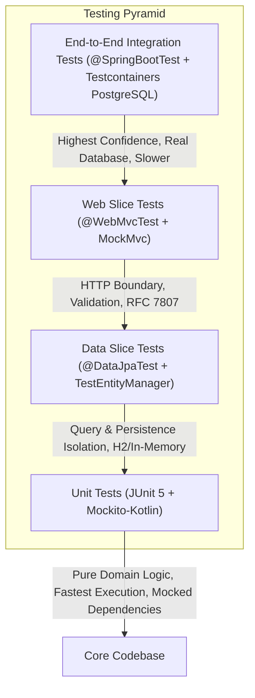

# Day 05: Unit & Integration Testing Pyramid

Welcome to **Day 05** of the ShopCraft Backend Master Course. In this module, you will master production-grade testing practices for Spring Boot and Kotlin applications. You will learn to construct a robust **Testing Pyramid** balancing speed, isolation, and confidence across **Unit Tests**, **Web MVC Slice Tests**, **Data JPA Slice Tests**, and modern **Testcontainers End-to-End Integration Tests**.

---

## 🎯 Learning Objectives

By the end of this module, you will master:
1. **The Testing Pyramid Architecture**: Understanding the operational trade-offs (speed, execution cost, context overhead, isolation, and fidelity) between Unit, Slice, and End-to-End integration tests.
2. **Unit Testing with Mockito-Kotlin**: Isolating domain business logic with JUnit 5 Jupiter, verifying interactions with `whenever`, asserting invocation counts with `verify(..., times(1))` and `verify(..., never())`, and introspecting internal state using `argumentCaptor<T>()`.
3. **Web MVC Slice Testing**: Testing `@RestController` web contracts in isolation using `@WebMvcTest` and `MockMvc`—asserting HTTP status codes, Location headers, Jackson JSON responses, and RFC 7807 `ProblemDetail` structures without loading the full Spring ApplicationContext.
4. **Data JPA Slice Testing & Persistence Context Hygiene**: Testing repository queries with `@DataJpaTest` and `TestEntityManager`. Understanding Hibernate's first-level cache and forcing true SQL execution via `persistAndFlush()` and `clear()`.
5. **Modern Testcontainers Integration Testing**: Zero-configuration containerized database testing using Spring Boot's `@ServiceConnection` and a real PostgreSQL container (`postgres:17-alpine`).
6. **Graceful Environment Adaptability**: Writing custom JUnit 5 `ExecutionCondition` extensions (`@EnabledIfDockerAvailable`) so test suites run smoothly in developer environments without Docker running.

---

## 🔬 Theoretical Foundations & Testing Mechanics

### 1. The Testing Pyramid Matrix

A well-architected test suite follows the Testing Pyramid: hundreds of fast, isolated unit tests at the base; targeted slice tests in the middle verifying component boundaries; and focused end-to-end integration tests at the top validating real-world infrastructure parity.



### Testing Trade-Offs Matrix

| Tier | Annotation | Scope Loaded | DB Used | Execution Speed | Primary Objective |
| :--- | :--- | :--- | :--- | :--- | :--- |
| **Unit** | Standard JUnit 5 | No Spring Context | None (Mocks) | ~1-5ms | Pure business logic, edge cases, error conditions, argument capture |
| **Web Slice** | `@WebMvcTest` | Controllers, Advisers, FilterChain, Jackson | None (Service Mocked) | ~100-300ms | HTTP status codes, JSON serialization/deserialization, Bean validation, headers |
| **Data Slice** | `@DataJpaTest` | Repositories, Entities, EntityManager | In-Memory (H2) | ~200-500ms | JPA queries, specifications, derived methods, entity lifecycles |
| **E2E Integration** | `@SpringBootTest` | Complete Spring Context, AOP, Services, Repos | Real PostgreSQL (Testcontainers) | ~1-3s | Full request-to-database roundtrip, aspect invocation, database dialect parity |

---

### 2. Mockito-Kotlin Idioms: `argumentCaptor` & Invariant Verification

When unit testing services, mocking repository dependencies prevents side effects and isolates business rules. However, asserting that a method was called is often insufficient—we must verify *what* arguments were passed.

```kotlin
// Capturing arguments passed to collaborators
val captor = argumentCaptor<Product>()
verify(productRepository).save(captor.capture())

val captured = captor.firstValue
assertThat(captured.sku).isEqualTo("SKU-CAPT-0001")
assertThat(captured.name).isEqualTo("Ergonomic Mechanical Keyboard")

// Verifying that dangerous or mutating methods were NEVER called
verify(productRepository, never()).save(any())
```

---

### 3. Web MVC Slice Testing: HTTP Contracts & RFC 7807

`@WebMvcTest` narrows the Spring Context to the web layer:
- Injects `MockMvc` for making simulated HTTP requests.
- Replaces backend services with `@MockitoBean`.
- Configures Spring MVC, message converters, and validation.
- Includes exception handlers via `@Import(GlobalExceptionHandler::class)`.

```kotlin
@WebMvcTest(ProductController::class)
@Import(SecurityConfig::class, GlobalExceptionHandler::class)
class ProductControllerWebMvcSliceTest {
    @Autowired private lateinit var mockMvc: MockMvc
    @MockitoBean private lateinit var productService: ProductService
    ...
}
```

This lets you test HTTP 400 Bad Request error payloads, header generation (`Location: /api/v1/products/42`), and custom RFC 7807 `ProblemDetail` structures without touching database queries.

---

### 4. Data JPA Slice Testing: The Hibernate First-Level Cache Trap

In `@DataJpaTest`, Spring bootstraps an in-memory database and wires up Spring Data JPA repositories alongside `TestEntityManager`.

> [!WARNING]
> **The First-Level Cache Trap**:
> When you save an entity with `productRepository.save(product)` or `testEntityManager.persist(product)`, the entity resides in Hibernate's Session (first-level cache). A subsequent `findBySku()` or `findById()` call might return the cached in-memory object **without executing an actual SQL SELECT query**!
>
> To test true SQL generation and database constraints:
> 1. `testEntityManager.persistAndFlush(entity)` — Writes changes to the database.
> 2. `testEntityManager.clear()` — Clears Hibernate's persistence context, forcing subsequent queries to execute real SQL SELECT queries against the database engine.

---

### 5. Modern Testcontainers with `@ServiceConnection`

Spring Boot 3.1+ introduced `@ServiceConnection`, eliminating manual `@DynamicPropertySource` boilerplate. Annotating a `PostgreSQLContainer` bean with `@ServiceConnection` automatically discovers the container's dynamically allocated port and configures `spring.datasource.url`, `username`, and `password`:

```kotlin
@TestConfiguration(proxyBeanMethods = false)
class PostgreSqlContainerConfig {

    @Bean
    @ServiceConnection
    fun postgresContainer(): PostgreSQLContainer {
        return PostgreSQLContainer(DockerImageName.parse("postgres:17-alpine"))
            .withDatabaseName("shopcraft_test")
            .withUsername("shopcraft")
            .withPassword("secret")
    }
}
```

Combined with our custom `@EnabledIfDockerAvailable` condition, developers and CI environments without a running Docker daemon skip the container test gracefully while all unit and slice tests execute at lightning speed.

---

## 🛠️ Step-by-Step Exercise Guide (`day-05-testing-starter`)

In `day-05-testing-starter`, you will implement the testing pyramid hands-on through 7 guided steps:

### Step 1: Unit Test Argument Verification
- Open [ProductServiceUnitTest.kt](file:///Users/platinum/IdeaProjects/spring-boot-kotlin-course/src/test/kotlin/com/example/shopcraft/testing/unit/ProductServiceUnitTest.kt).
- Implement `given existing product, when updateProduct with conflicting sku, then verifies repository save is never called`.
- Mock repository queries to simulate an existing product and a conflicting SKU.
- Verify `verify(productRepository, never()).save(any())`.

### Step 2: Unit Test with `argumentCaptor`
- In [ProductServiceUnitTest.kt](file:///Users/platinum/IdeaProjects/spring-boot-kotlin-course/src/test/kotlin/com/example/shopcraft/testing/unit/ProductServiceUnitTest.kt), implement `given valid product request, when createProduct, then captures argument and asserts exact fields saved`.
- Use `argumentCaptor<Product>()` and verify exact field mappings before persistence.

### Step 3: WebMvc Slice Validation Assertion
- Open [ProductControllerWebMvcSliceTest.kt](file:///Users/platinum/IdeaProjects/spring-boot-kotlin-course/src/test/kotlin/com/example/shopcraft/testing/slice/web/ProductControllerWebMvcSliceTest.kt).
- Implement `given invalid product payload with blank name, when POST api v1 products, then returns 400 Bad Request with field error`.
- Verify HTTP 400 status and JSON path `$.errors[?(@.field == 'name')]`.

### Step 4: WebMvc Slice Response & Location Header
- In [ProductControllerWebMvcSliceTest.kt](file:///Users/platinum/IdeaProjects/spring-boot-kotlin-course/src/test/kotlin/com/example/shopcraft/testing/slice/web/ProductControllerWebMvcSliceTest.kt), implement `given valid product request, when POST api v1 products, then returns 201 Created with Location header`.
- Verify HTTP 201, `Location` header, and response payload.

### Step 5: DataJpa Slice with `TestEntityManager`
- Open [ProductRepositoryDataJpaSliceTest.kt](file:///Users/platinum/IdeaProjects/spring-boot-kotlin-course/src/test/kotlin/com/example/shopcraft/testing/slice/data/ProductRepositoryDataJpaSliceTest.kt).
- Implement `given persisted product in test entity manager, when findBySku after clearing persistence context, then queries database directly`.
- Use `testEntityManager.persistAndFlush()` followed by `testEntityManager.clear()` to defeat the first-level cache.

### Step 6: Testcontainers `@ServiceConnection`
- Inspect [PostgreSqlContainerConfig.kt](file:///Users/platinum/IdeaProjects/spring-boot-kotlin-course/src/test/kotlin/com/example/shopcraft/testing/support/PostgreSqlContainerConfig.kt).
- Configure the `@TestConfiguration` class with `@ServiceConnection` and `PostgreSQLContainer("postgres:17-alpine")`.

### Step 7: End-to-End Testcontainers Integration Test
- Open [ProductEndToEndIntegrationTest.kt](file:///Users/platinum/IdeaProjects/spring-boot-kotlin-course/src/test/kotlin/com/example/shopcraft/testing/integration/ProductEndToEndIntegrationTest.kt).
- Implement `given valid product request, when POST api v1 products, then persists in real postgresql and records audit event in database`.
- Perform a real HTTP POST request with `MockMvc`, assert real database persistence, and verify the AOP `@AuditLog` event was recorded in the database.

---

## 🚀 Verification Commands

Run the complete test suite:
```bash
./gradlew test --rerun-tasks
```

Run only unit tests:
```bash
./gradlew test --tests "*UnitTest"
```

Run only slice tests:
```bash
./gradlew test --tests "*SliceTest"
```

Run only integration tests:
```bash
./gradlew test --tests "*IntegrationTest"
```
