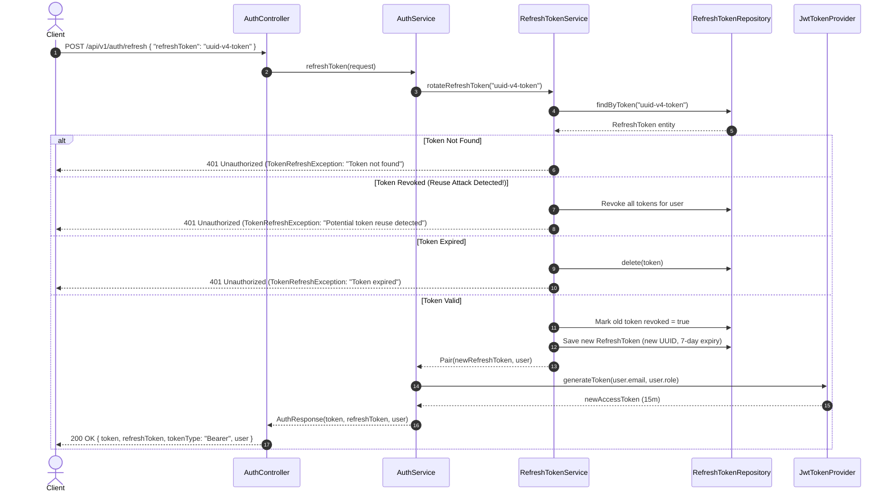
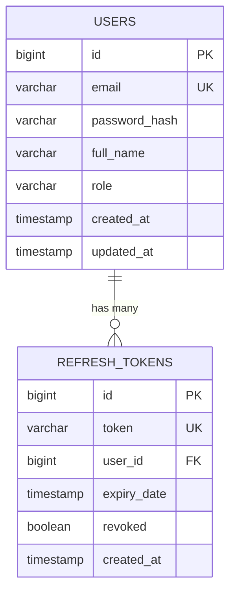

# Day 06 Part 2: Refresh Token Mechanism & Rotation

Welcome to **Day 06 Part 2** of the ShopCraft Backend Master Course. In Part 1, you built a stateless authentication system using **JSON Web Tokens (JWT)** and granular **Role-Based Access Control (RBAC)**.

While pure stateless JWTs excel at performance and horizontal scalability, they pose a critical security challenge: **they cannot be easily invalidated before expiration without introducing shared server state**. If an access token with a long lifetime (e.g., 24 hours) is intercepted, an attacker possesses unrestricted access for that full duration.

In Part 2, you will implement an enterprise **Token Rotation & Revocation Architecture**:
1. **Short-Lived Access Tokens**: JWTs expire in 15 minutes (`expiration-ms: 900000`).
2. **Long-Lived Refresh Tokens**: Secure, persistent opaque tokens stored in PostgreSQL with a 7-day lifetime (`refresh-token-expiration-ms: 604800000`).
3. **Refresh Token Rotation (RTR)**: Every time a refresh token is exchanged for a new access token, the used refresh token is invalidated and a fresh refresh token is issued.
4. **Token Reuse Detection & Family Revocation**: If a previously revoked refresh token is presented (indicating a replay or theft attack), all refresh tokens belonging to that user are immediately invalidated, forcing a full credential re-authentication.
5. **Clean Logout Semantics**: Revoking active refresh tokens on demand.

---

## 🎯 Learning Objectives

By the end of Part 2, you will master:
1. **The Access Token vs. Refresh Token Dilemma**: Why distributed systems separate authorization credentials (short-lived JWTs) from session persistence credentials (refresh tokens).
2. **Refresh Token Rotation (RTR)**: Preventing replay attacks by ensuring each refresh token is single-use.
3. **Breach Detection & Family Revocation**: Detecting concurrent token usage and protecting compromised accounts by terminating all active user sessions.
4. **JPA Lifecycle Management for Session Tokens**: Modeling `RefreshToken` with `@ManyToOne` user associations, expiry tracking, and revocation flags.
5. **RFC 7807 ProblemDetail for Token Refresh Errors**: Returning structured HTTP 401 ProblemDetail responses for expired, revoked, or non-existent refresh tokens.
6. **Graceful User Logout**: Explicitly revoking refresh tokens to terminate sessions cleanly.

---

## 🔬 Architecture & Token Lifecycle

### 1. Token Refresh & Rotation Flow


### 2. Entity Relationship


---

## 🛠️ Step-by-Step Implementation Guide

### Step 1: RefreshToken Entity & Repository
- Open [RefreshToken.kt](file:///Users/platinum/IdeaProjects/spring-boot-kotlin-course/src/main/kotlin/com/example/shopcraft/auth/entity/RefreshToken.kt).
- Map to the `refresh_tokens` table with `@Entity`, `@Table(name = "refresh_tokens")`.
- Store `token` (unique UUID string), `@ManyToOne(fetch = FetchType.LAZY)` to `User`, `expiryDate: Instant`, `revoked: Boolean`, and `createdAt: Instant`.
- In [RefreshTokenRepository.kt](file:///Users/platinum/IdeaProjects/spring-boot-kotlin-course/src/main/kotlin/com/example/shopcraft/auth/repository/RefreshTokenRepository.kt), provide query methods `findByToken(token: String): RefreshToken?` and `findAllByUser(user: User): List<RefreshToken>`.

### Step 2: RFC 7807 Error Handling
- Open [TokenRefreshException.kt](file:///Users/platinum/IdeaProjects/spring-boot-kotlin-course/src/main/kotlin/com/example/shopcraft/common/exception/TokenRefreshException.kt).
- In [GlobalExceptionHandler.kt](file:///Users/platinum/IdeaProjects/spring-boot-kotlin-course/src/main/kotlin/com/example/shopcraft/common/exception/GlobalExceptionHandler.kt), map `TokenRefreshException` to `HttpStatus.UNAUTHORIZED` with `title = "Token Refresh Failed"`.

### Step 3: RefreshTokenService Implementation
- Open [RefreshTokenServiceImpl.kt](file:///Users/platinum/IdeaProjects/spring-boot-kotlin-course/src/main/kotlin/com/example/shopcraft/auth/service/RefreshTokenServiceImpl.kt).
- Implement `createRefreshToken`: mint a new UUID token with expiry configured from `JwtProperties.refreshTokenExpirationMs`.
- Implement `rotateRefreshToken`:
  - Find token; throw `TokenRefreshException` if not found.
  - If `token.revoked == true`: trigger **Reuse Detection**, revoke all user tokens with `revokeAllUserTokens(token.user)`, and throw `TokenRefreshException`.
  - If `token.isExpired()`: delete token and throw `TokenRefreshException`.
  - Mark old token as revoked (`revoked = true`), save, and create a brand new refresh token.
- Implement `revokeRefreshToken` and `revokeAllUserTokens`.

### Step 4: AuthServiceImpl Integration
- Open [AuthServiceImpl.kt](file:///Users/platinum/IdeaProjects/spring-boot-kotlin-course/src/main/kotlin/com/example/shopcraft/auth/service/AuthServiceImpl.kt).
- Inject `RefreshTokenService`.
- On `register` and `login`: create a refresh token and return it in `AuthResponse`.
- Implement `refreshToken(request)`: invoke `refreshTokenService.rotateRefreshToken(request.refreshToken)` and generate a fresh access token.
- Implement `logout(request)`: invoke `refreshTokenService.revokeRefreshToken(request.refreshToken)`.

### Step 5: Controller Endpoints
- Open [AuthController.kt](file:///Users/platinum/IdeaProjects/spring-boot-kotlin-course/src/main/kotlin/com/example/shopcraft/auth/controller/AuthController.kt).
- Expose `POST /api/v1/auth/refresh` accepting `@Valid @RequestBody RefreshTokenRequest`.
- Expose `POST /api/v1/auth/logout` accepting `@Valid @RequestBody RefreshTokenRequest` returning `204 No Content`.

---

## 🚀 Verification Commands

Run the complete test suite:
```bash
./gradlew test --rerun-tasks
```

Run only refresh token unit and slice tests:
```bash
./gradlew test --tests "com.example.shopcraft.auth.service.RefreshTokenServiceTest"
./gradlew test --tests "com.example.shopcraft.auth.controller.AuthControllerRefreshTest"
```

Run full E2E refresh token rotation & reuse integration test:
```bash
./gradlew test --tests "com.example.shopcraft.auth.RefreshTokenIntegrationTest"
```
