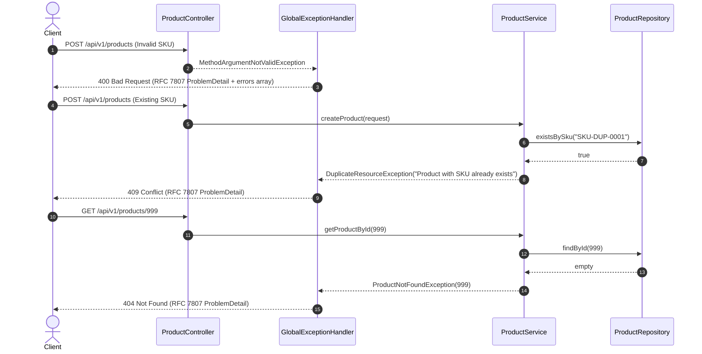

# Day 03: Validation, Error Handling & RFC 7807 Problem Details

Welcome to **Day 03** of the ShopCraft Backend Master Course. In this module, you will learn how to enforce data integrity at the HTTP boundary using Jakarta Bean Validation, harness Kotlin use-site targets, craft custom constraint validators, and build a production-grade centralized exception handling architecture adhering to the RFC 7807 `ProblemDetail` standard.

---

## 🎯 Learning Objectives

By the end of this module, you will master:
1. **Jakarta Bean Validation**: Applying constraints (`@NotBlank`, `@Size`, `@Positive`, `@Min`, `@NotNull`) to incoming DTOs.
2. **Kotlin Use-Site Targets**: Understanding Kotlin property compilation and why `@field:` is mandatory when annotating constructor properties in data classes for Bean Validation.
3. **Custom Constraint Validation**: Creating custom annotations (`@ValidSku`) and validators (`SkuValidator : ConstraintValidator<ValidSku, String?>`) with regex pattern enforcement (`^SKU-[A-Z]{3}-\d{4}$`).
4. **RFC 7807 `ProblemDetail`**: Implementing modern Spring Boot error responses using `org.springframework.http.ProblemDetail` enriched with structured error collections and timestamps.
5. **Centralized Exception Handling**: Crafting `@RestControllerAdvice` methods for `MethodArgumentNotValidException`, `ResourceNotFoundException`, `DuplicateResourceException`, and malformed payloads.
6. **Controller Integration**: Activating request validation using `@Valid` on controller endpoints.

---

## 🔬 Theoretical Foundations & Kotlin Mechanics

### 1. The Kotlin Use-Site Target Problem

In Kotlin, a concise primary constructor property declaration:
```kotlin
data class ProductRequest(
    val name: String
)
```
actually compiles to three separate bytecode elements:
1. A constructor parameter in the generated constructor: `String name`
2. A private backing field: `private final String name`
3. A public getter method: `public final String getName()`

When an annotation without a specified target is placed on a constructor property:
```kotlin
data class ProductRequest(
    @NotBlank val name: String
)
```
Kotlin defaults to placing the annotation on the **constructor parameter** or property, depending on compiler settings. However, Jakarta Bean Validation (Hibernate Validator) runtime reflection inspects **fields** or **getter methods** on the instantiated bean!

To guarantee that Jakarta Bean Validation detects the constraint during HTTP request body deserialization, you must explicitly declare the **use-site target**:
```kotlin
data class ProductRequest(
    @field:NotBlank(message = "Name must not be blank")
    @field:Size(min = 2, max = 100, message = "Name must be between 2 and 100 characters")
    val name: String
)
```

Common Kotlin use-site targets include:
- `@field:` – Backing field of the property.
- `@get:` – Property getter.
- `@param:` – Constructor parameter.
- `@set:` – Property setter.

---

### 2. Custom Constraint Architecture

When built-in annotations do not cover domain-specific formats (e.g. ShopCraft SKU format `SKU-XXX-0000`), Jakarta Bean Validation provides an extensible SPI:

```mermaid
classDiagram
    class ValidSku {
        <<annotation>>
        +String message
        +Class[] groups
        +Class[] payload
    }
    class SkuValidator {
        -Regex skuRegex
        +isValid(String, ConstraintValidatorContext) Boolean
    }
    ConstraintValidator <|.. SkuValidator : implements
    ValidSku ..> SkuValidator : @Constraint(validatedBy = [SkuValidator::class])
```

#### Best Practices for Custom Validators:
- **Null Safety**: Always return `true` when the value is `null`. Nullability constraints should be handled independently by `@NotNull` or `@NotBlank`. This honors the Single Responsibility Principle.
- **Compiled Regex**: Store regex patterns in static/singleton variables (`Regex("^SKU-[A-Z]{3}-\\d{4}$")`) rather than recompiling the pattern on every request invocation.

---

### 3. RFC 7807 Problem Details for HTTP APIs

Before RFC 7807, APIs returned disparate error shapes (e.g. `{ "error": "...", "status": 400 }` or `{ "msg": "..." }`). RFC 7807 defines a standardized JSON structure with standard top-level keys:
- `type`: URI identifying the error problem type.
- `title`: Short, human-readable summary.
- `status`: HTTP status code.
- `detail`: Human-readable explanation specific to this occurrence.
- `instance`: URI of the resource/endpoint where the error occurred.

Spring Boot 3/4 includes `org.springframework.http.ProblemDetail`, allowing custom extension attributes via `.setProperty("key", value)`:

```json
{
  "type": "https://shopcraft.example.com/errors/validation-failed",
  "title": "Validation Failed",
  "status": 400,
  "detail": "Validation failed for 2 field(s)",
  "instance": "/api/v1/products",
  "timestamp": "2026-09-30T10:15:30.123456Z",
  "errors": [
    {
      "field": "name",
      "rejectedValue": "",
      "message": "Name must not be blank"
    },
    {
      "field": "price",
      "rejectedValue": -5.00,
      "message": "Price must be strictly positive"
    }
  ]
}
```

---

## 🏛️ Request Validation & Error Flow Architecture



---

## 🛠️ Step-by-Step Exercise Walkthrough (Starter Progression)

When working on `day-03-validation-error-handling-starter`, complete the 9 guided steps:

### Step 1: Implement `SkuValidator`
- File: `src/main/kotlin/com/example/shopcraft/product/validation/SkuValidator.kt`
- Implement `isValid(value: String?, context: ConstraintValidatorContext?): Boolean`.
- Return `true` if `value` is `null`.
- Test against regex `^SKU-[A-Z]{3}-\d{4}$`.

### Step 2: Annotate `ProductRequest` with Validation Constraints
- File: `src/main/kotlin/com/example/shopcraft/product/dto/ProductDtos.kt`
- Use `@field:` use-site targets on all constructor properties:
  - `sku`: `@field:NotBlank`, `@field:ValidSku`
  - `name`: `@field:NotBlank`, `@field:Size(min = 2, max = 100)`
  - `description`: `@field:Size(max = 1000)`
  - `price`: `@field:NotNull`, `@field:Positive`
  - `stockQuantity`: `@field:NotNull`, `@field:Min(0)`
  - `status`: `@field:NotNull`

### Step 3: Enforce SKU Uniqueness in `ProductServiceImpl.createProduct`
- File: `src/main/kotlin/com/example/shopcraft/product/service/ProductServiceImpl.kt`
- Check `productRepository.existsBySku(request.sku)`.
- If `true`, throw `DuplicateResourceException("Product with SKU '${request.sku}' already exists")`.

### Step 4: Enforce SKU Uniqueness in `ProductServiceImpl.updateProduct`
- File: `src/main/kotlin/com/example/shopcraft/product/service/ProductServiceImpl.kt`
- Check `productRepository.findBySku(request.sku)`.
- If an existing entity has the same SKU and a different `id`, throw `DuplicateResourceException`.

### Step 5: Implement `handleValidationException` in `GlobalExceptionHandler`
- File: `src/main/kotlin/com/example/shopcraft/common/exception/GlobalExceptionHandler.kt`
- Extract all `fieldErrors` from `BindingResult` into `FieldErrorDetail(field, rejectedValue, message)`.
- Construct `ProblemDetail.forStatusAndDetail(HttpStatus.BAD_REQUEST, ...)`.
- Attach `title = "Validation Failed"`, `timestamp = Instant.now()`, and `errors = fieldErrors`.

### Step 6: Implement `handleResourceNotFoundException` in `GlobalExceptionHandler`
- File: `src/main/kotlin/com/example/shopcraft/common/exception/GlobalExceptionHandler.kt`
- Construct `ProblemDetail.forStatusAndDetail(HttpStatus.NOT_FOUND, ex.message)`.
- Attach `title = "Resource Not Found"` and `timestamp`.

### Step 7: Implement `handleDuplicateResourceException` in `GlobalExceptionHandler`
- File: `src/main/kotlin/com/example/shopcraft/common/exception/GlobalExceptionHandler.kt`
- Construct `ProblemDetail.forStatusAndDetail(HttpStatus.CONFLICT, ex.message)`.
- Attach `title = "Resource Conflict"` and `timestamp`.

### Step 8: Implement `handleMessageNotReadableException` in `GlobalExceptionHandler`
- File: `src/main/kotlin/com/example/shopcraft/common/exception/GlobalExceptionHandler.kt`
- Construct `ProblemDetail.forStatusAndDetail(HttpStatus.BAD_REQUEST, "Malformed JSON request body...")`.
- Attach `title = "Malformed Request Body"` and `timestamp`.

### Step 9: Annotate Controller Endpoints with `@Valid`
- File: `src/main/kotlin/com/example/shopcraft/product/controller/ProductController.kt`
- Annotate `@Valid @RequestBody request: ProductRequest` on `createProduct` and `updateProduct`.
- Annotate `@Valid @RequestBody request: ProductPatchRequest` on `patchProduct`.

---

## 🧪 Verification & Automated Testing

All tests in this course adhere to the **Given-When-Then** BDD testing convention:
- Test method names use descriptive Kotlin backticks.
- Test bodies are cleanly partitioned into Given, When, and Then phases using blank lines only (no `// Given` comments).
- Redundant `@DisplayName` annotations are omitted.

Run the test suite from your terminal:
```bash
./gradlew test
```

### Expected Output:
- **On `day-03-validation-error-handling-solution`**:
  All **44 tests** pass with **100% green**:
  - `SkuValidatorTest` (5 unit tests)
  - `GlobalExceptionHandlerTest` (4 unit tests)
  - `ProductControllerTest` (11 web slice tests)
  - `ProductServiceTest` (10 unit tests)
  - `ProductSpecificationsTest` (5 repository slice tests)
  - `ProductRepositoryTest` (3 slice tests)
  - `ProductMappingTest` (2 unit tests)
  - `PagedResponseTest` (2 unit tests)
  - `ShopcraftApplicationTests` (1 context baseline)
- **On `day-03-validation-error-handling-starter`**:
  Day 01 and Day 02 tests pass; Day 03 exercise tests fail cleanly with `NotImplementedError` or assertion errors pointing directly to Steps 1 through 9.

---

## 🌐 Manual Verification with HTTP / cURL / Postman

Test fixtures are provided in the [`requests/`](file:///Users/platinum/IdeaProjects/spring-boot-kotlin-course/requests) directory:
- **`requests/day03.http`**: IntelliJ IDEA & VS Code REST client definitions.
- **`requests/day03.curl.sh`**: Executable script hitting validation and exception endpoints.
- **`requests/day03.postman_collection.json`**: Postman v2.1 collection with response assertion scripts.

Run the cURL suite against a running server:
```bash
./requests/day03.curl.sh
```
