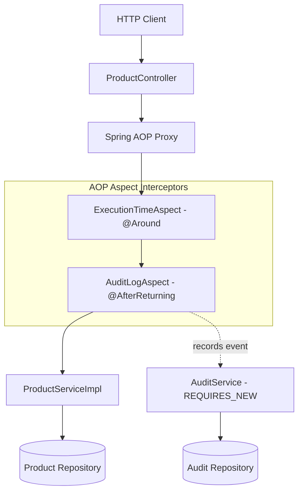
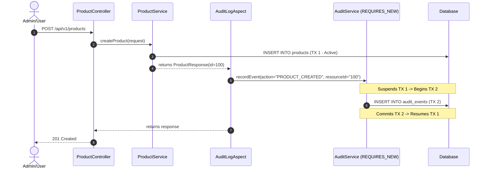

# Day 04: Aspect-Oriented Programming (AOP) & Audit Logging

Welcome to **Day 04** of the ShopCraft Backend Master Course. In this module, you will learn how to decouple cross-cutting concerns from core business logic using Spring AOP, implement performance telemetry with `@Around` advice, build an automated auditing system with `@AfterReturning`, and enforce transactional isolation using `Propagation.REQUIRES_NEW`.

---

## 🎯 Learning Objectives

By the end of this module, you will master:
1. **Aspect-Oriented Programming (AOP)**: Understanding core concepts—Join Points, Pointcut designators, Advice types (`@Around`, `@AfterReturning`), and runtime proxy mechanics.
2. **Performance Telemetry**: Creating custom `@TrackExecutionTime` annotations and `@Around` advice to profile execution duration and log warnings on latency regressions.
3. **Automated Audit Logging**: Capturing state-mutating operations transparently using `@AuditLog` and `@AfterReturning` advice without polluting domain services.
4. **Transactional Isolation (`Propagation.REQUIRES_NEW`)**: Persisting audit events in an independent transaction so audit records survive business transaction rollbacks.
5. **Admin Querying API**: Exposing `GET /api/v1/admin/audit-logs` returning a paginated history using the `PagedResponse` envelope.

---

## 🔬 Theoretical Foundations & Spring AOP Mechanics

### 1. Cross-Cutting Concerns & AOP Terminology

In enterprise systems, non-functional concerns (logging, security checks, metrics, transaction management, caching) cut across multiple domain services. Mixing these into service methods violates the Single Responsibility Principle and degrades maintainability.

Spring AOP uses dynamic proxies to intercept method executions:

- **Join Point**: A candidate point in the execution of the program where an aspect can be plugged in. In Spring AOP, this is always a method execution.
- **Pointcut**: A predicate expression that matches join points. For example: `@annotation(com.example.shopcraft.audit.annotation.AuditLog)` matches any method annotated with `@AuditLog`.
- **Advice**: Action taken by an aspect at a particular join point.
  - `@Before`: Runs before the join point method executes.
  - `@AfterReturning`: Runs after the join point completes successfully without throwing an exception. Can access the returned value.
  - `@AfterThrowing`: Runs if the method throws an exception.
  - `@After`: Runs after the method completes (regardless of success or failure).
  - `@Around`: Surrounds the join point method. Has full control over whether and when to invoke `joinPoint.proceed()`, can alter arguments or return values, and measures execution duration.
- **Aspect**: A modularization of a cross-cutting concern encapsulating pointcuts and advice.



---

### 2. Transactional Isolation via `Propagation.REQUIRES_NEW`

When auditing business operations, saving audit records inside the same database transaction as the business operation introduces a critical vulnerability:
If the business operation encounters an error or rolls back, the audit record is rolled back with it!

Spring's `@Transactional(propagation = Propagation.REQUIRES_NEW)` solves this:
1. When `recordEvent(...)` is invoked, Spring suspends the caller's active transaction.
2. Spring opens a brand new, isolated physical database connection/transaction.
3. The `AuditEvent` is persisted and immediately committed.
4. Spring resumes the caller's outer transaction.



---

## 🛠️ Step-by-Step Exercise Walkthrough (Starter Progression)

When working on `day-04-aop-starter`, complete the 7 guided steps:

### Step 1: Implement `AuditEvent.toResponse`
- File: `src/main/kotlin/com/example/shopcraft/audit/entity/AuditEvent.kt`
- Map the entity properties to an immutable `AuditEventResponse` DTO.

### Step 2: Implement `recordEvent` in `AuditServiceImpl`
- File: `src/main/kotlin/com/example/shopcraft/audit/service/AuditServiceImpl.kt`
- Annotate with `@Transactional(propagation = Propagation.REQUIRES_NEW)`.
- Instantiate an `AuditEvent` entity with parameters, save it via `auditEventRepository`, and return its DTO.

### Step 3: Implement `getAuditEvents` in `AuditServiceImpl`
- File: `src/main/kotlin/com/example/shopcraft/audit/service/AuditServiceImpl.kt`
- Query `auditEventRepository.findAllByOrderByTimestampDesc(pageable)`.
- Transform the `Page<AuditEvent>` into `PagedResponse<AuditEventResponse>`.

### Step 4: Implement `measureExecutionTime` in `ExecutionTimeAspect`
- File: `src/main/kotlin/com/example/shopcraft/audit/aspect/ExecutionTimeAspect.kt`
- Use `@Around("@annotation(trackExecutionTime)")`.
- Record start time, proceed with `joinPoint.proceed()`, compute duration, and log a warning if duration exceeds `trackExecutionTime.thresholdMs`.

### Step 5: Implement `logSuccessfulOperation` in `AuditLogAspect`
- File: `src/main/kotlin/com/example/shopcraft/audit/aspect/AuditLogAspect.kt`
- Use `@AfterReturning(pointcut = "@annotation(auditLog)", returning = "result")`.
- Extract resource ID from `result` (if `ProductResponse`) or method arguments.
- Call `auditService.recordEvent(...)`.

### Step 6: Annotate `ProductServiceImpl` Methods
- File: `src/main/kotlin/com/example/shopcraft/product/service/ProductServiceImpl.kt`
- Apply `@TrackExecutionTime(thresholdMs = 100)` on queries (`getProducts`, `getAllProducts`, `getProductById`).
- Apply `@AuditLog` on mutating methods (`createProduct`, `updateProduct`, `patchProduct`, `deleteProduct`).

### Step 7: Implement `getAuditLogs` in `AdminAuditController`
- File: `src/main/kotlin/com/example/shopcraft/audit/controller/AdminAuditController.kt`
- Annotate endpoint with `@GetMapping`.
- Delegate to `auditService.getAuditEvents(pageable)` and return `200 OK` with `PagedResponse`.

---

## 🧪 Verification & Automated Testing

All tests in this course adhere to the **Given-When-Then** BDD testing convention:
- Function names use descriptive Kotlin backticks.
- Test bodies are cleanly partitioned into Given, When, and Then phases using blank lines only.
- Redundant `@DisplayName` annotations are omitted.

Run the test suite from your terminal:
```bash
./gradlew test
```

### Expected Output:
- **On `day-04-aop-solution`**:
  All **50+ tests** pass with **100% green**:
  - `ExecutionTimeAspectTest` (2 unit tests)
  - `AuditLogAspectTest` (2 unit tests)
  - `AuditServiceTest` (2 unit tests)
  - `AdminAuditControllerTest` (1 web slice test)
  - `AuditEventRepositoryTest` (2 data slice tests)
  - `AuditIntegrationTest` (1 integration test)
  - All baseline Day 01-03 test suites (44 tests)
- **On `day-04-aop-starter`**:
  Baseline tests pass; Day 04 exercise tests fail cleanly with `NotImplementedError` or assertion errors pointing directly to Steps 1 through 7.

---

## 🌐 Manual Verification with HTTP / cURL / Postman

Test fixtures are provided in the [`requests/`](file:///Users/platinum/IdeaProjects/spring-boot-kotlin-course/requests) directory:
- **`requests/day04.http`**: IntelliJ IDEA & VS Code REST client definitions.
- **`requests/day04.curl.sh`**: Executable script creating products and querying audit records.
- **`requests/day04.postman_collection.json`**: Postman v2.1 collection with response assertion scripts.

Run the cURL suite against a running server:
```bash
./requests/day04.curl.sh
```
