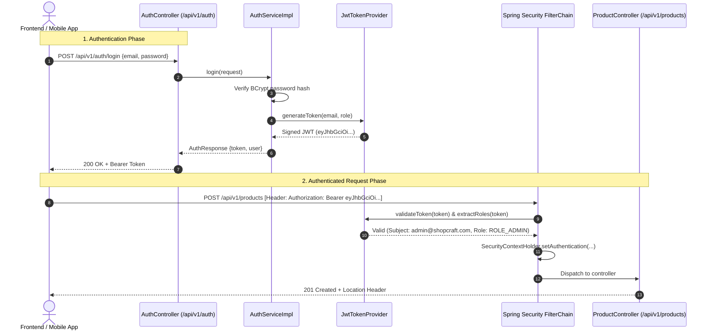
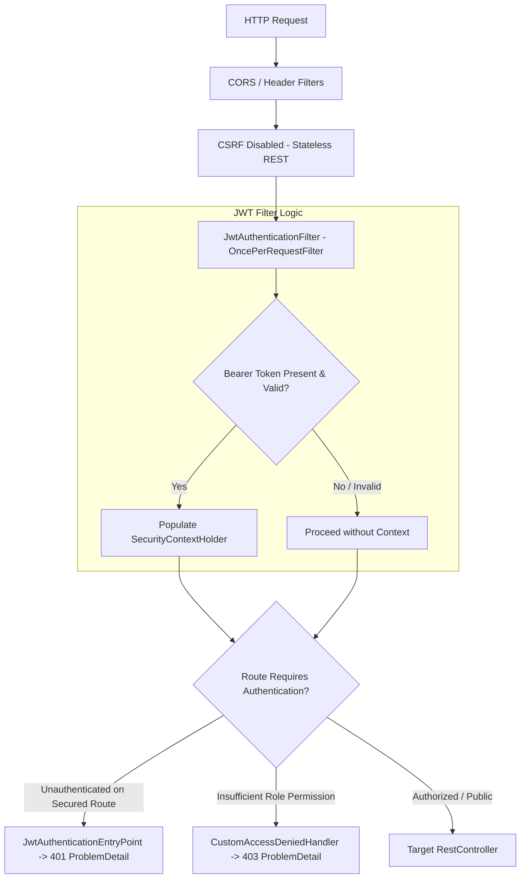

# Day 06: JWT Authentication & Role-Based Access Control (RBAC)

Welcome to **Day 06** of the ShopCraft Backend Master Course. In this module, you will master enterprise-grade security for modern distributed systems and microservices. You will learn to build a completely **stateless authentication system** using **JSON Web Tokens (JWT)** via the modern **JJWT 0.12.x** library, integrate a custom `OncePerRequestFilter` into the Spring Security 7.x FilterChain, format all security exceptions according to **RFC 7807 `ProblemDetail`**, and enforce granular **Role-Based Access Control (RBAC)** across customer and administrator roles.

---

## 🎯 Learning Objectives

By the end of this module, you will master:
1. **Stateless Security vs Stateful Sessions**: Why modern REST APIs discard server-side session cookies (`SessionCreationPolicy.STATELESS`) in favor of cryptographically signed Bearer tokens for horizontal scalability and cross-domain resilience.
2. **Modern JJWT 0.12.x Mechanics**: Constructing (`Jwts.builder()`), signing (`Keys.hmacShaKeyFor()`), verifying, and parsing signed JWT claims with the latest fluent JJWT API.
3. **Spring Security Filter Chain**: Intercepting incoming HTTP requests with `JwtAuthenticationFilter` (`OncePerRequestFilter`), extracting the `Authorization: Bearer <token>` header, and populating `SecurityContextHolder`.
4. **RFC 7807 Security Compliance**: Implementing `AuthenticationEntryPoint` (401 Unauthorized) and `AccessDeniedHandler` (403 Forbidden) so that authentication and authorization rejections return structured `ProblemDetail` JSON instead of default container HTML error pages.
5. **Password Salting & Hashing**: Utilizing `BCryptPasswordEncoder` to safeguard customer credentials against rainbow table and brute-force attacks.
6. **Role-Based Access Control (RBAC)**: Distinguishing between `ROLE_USER` and `ROLE_ADMIN` to protect catalog mutations (`POST`, `PUT`, `PATCH`, `DELETE`) and admin audit queries while keeping catalog browsing public.

---

## 🔬 Theoretical Foundations & Security Architecture

### 1. The Anatomy of a JSON Web Token (JWT)

A JWT is a compact, URL-safe means of representing claims to be transferred between two parties. It consists of three parts separated by dots (`.`):

$$\text{JWT} = \underbrace{\text{Base64Url}(\text{Header})}_{\text{Algorithm \& Token Type}} \;.\; \underbrace{\text{Base64Url}(\text{Payload})}_{\text{Claims: subject, roles, expiry}} \;.\; \underbrace{\text{Base64Url}(\text{Signature})}_{\text{HMAC-SHA256 signature}}$$



---

### 2. Spring Security FilterChain Pipeline

In Spring Security, all incoming HTTP requests traverse a chain of servlet filters. For stateless REST APIs, we customize this chain:



---

### 3. Route Authorization Matrix

| Endpoint | HTTP Method | Permitted Roles | Description |
| :--- | :--- | :--- | :--- |
| `/api/v1/auth/register` | `POST` | Public (`permitAll`) | Register new customer account (`ROLE_USER`) |
| `/api/v1/auth/login` | `POST` | Public (`permitAll`) | Authenticate credentials and receive Bearer JWT token |
| `/api/v1/auth/me` | `GET` | Authenticated (`ROLE_USER` or `ROLE_ADMIN`) | Retrieve authenticated user profile from SecurityContext |
| `/api/v1/products/**` | `GET` | Public (`permitAll`) | Browse catalog and view product details |
| `/api/v1/products` | `POST` | `ROLE_ADMIN` | Create new product entity |
| `/api/v1/products/{id}` | `PUT` | `ROLE_ADMIN` | Fully update existing product |
| `/api/v1/products/{id}` | `PATCH` | `ROLE_ADMIN` | Partially patch product |
| `/api/v1/products/{id}` | `DELETE` | `ROLE_ADMIN` | Delete product (204 No Content) |
| `/api/v1/admin/audit-logs` | `GET` | `ROLE_ADMIN` | Query audit trail |
| `/h2-console/**` | Any | Public (`permitAll`) | In-memory database web console |

---

## 🛠️ Step-by-Step Exercise Guide (`day-06-jwt-authentication-starter`)

In `day-06-jwt-authentication-starter`, you will implement the security system through 8 guided steps:

### Step 1: User Response Mapping
- Open [User.kt](file:///Users/platinum/IdeaProjects/spring-boot-kotlin-course/src/main/kotlin/com/example/shopcraft/auth/entity/User.kt).
- Implement `toResponse(): UserResponse` mapping the entity state into an immutable data class.

### Step 2: JWT Token Minting with JJWT 0.12.x
- Open [JwtTokenProvider.kt](file:///Users/platinum/IdeaProjects/spring-boot-kotlin-course/src/main/kotlin/com/example/shopcraft/auth/security/JwtTokenProvider.kt).
- Implement `generateToken(email: String, role: Role): String` using `Jwts.builder()`.
- Add claims for subject, roles, issuedAt, and expiration, and sign with HMAC-SHA.

### Step 3: JWT Token Validation & Claims Parsing
- In [JwtTokenProvider.kt](file:///Users/platinum/IdeaProjects/spring-boot-kotlin-course/src/main/kotlin/com/example/shopcraft/auth/security/JwtTokenProvider.kt), implement `validateToken`, `extractUsername`, and `extractRoles`.
- Use `Jwts.parser().verifyWith(key).build().parseSignedClaims(token).payload`.

### Step 4: Security Filter Chain Token Extraction
- Open [JwtAuthenticationFilter.kt](file:///Users/platinum/IdeaProjects/spring-boot-kotlin-course/src/main/kotlin/com/example/shopcraft/auth/security/JwtAuthenticationFilter.kt).
- Implement `doFilterInternal` extracting the Bearer token from the `Authorization` header.
- Validate the token and populate `SecurityContextHolder.getContext().authentication`.

### Step 5: User Registration Business Logic
- Open [AuthServiceImpl.kt](file:///Users/platinum/IdeaProjects/spring-boot-kotlin-course/src/main/kotlin/com/example/shopcraft/auth/service/AuthServiceImpl.kt).
- Implement `register(request: RegisterRequest): AuthResponse`.
- Verify email uniqueness, hash the password using `passwordEncoder.encode()`, persist the `User`, and mint a token.

### Step 6: User Authentication & Token Issuance
- In [AuthServiceImpl.kt](file:///Users/platinum/IdeaProjects/spring-boot-kotlin-course/src/main/kotlin/com/example/shopcraft/auth/service/AuthServiceImpl.kt), implement `login(request: LoginRequest): AuthResponse`.
- Verify credentials with `passwordEncoder.matches()` and issue a JWT token. Also implement `getCurrentUser()`.

### Step 7: Security FilterChain Configuration
- Open [SecurityConfig.kt](file:///Users/platinum/IdeaProjects/spring-boot-kotlin-course/src/main/kotlin/com/example/shopcraft/common/config/SecurityConfig.kt).
- Configure stateless session management, register `JwtAuthenticationFilter`, configure `JwtAuthenticationEntryPoint` and `CustomAccessDeniedHandler`, and declare RBAC endpoint rules.

### Step 8: Authentication Controller Endpoints
- Open [AuthController.kt](file:///Users/platinum/IdeaProjects/spring-boot-kotlin-course/src/main/kotlin/com/example/shopcraft/auth/controller/AuthController.kt).
- Follow guided comments to annotate methods with `@PostMapping("/register")`, `@PostMapping("/login")`, and `@GetMapping("/me")`, using `@Valid` and `@RequestBody`.

---

## 🚀 Verification Commands

Run the complete test suite:
```bash
./gradlew test --rerun-tasks
```

Run only authentication unit tests:
```bash
./gradlew test --tests "com.example.shopcraft.auth.security.*"
./gradlew test --tests "com.example.shopcraft.auth.service.*"
```

Run only security RBAC integration tests:
```bash
./gradlew test --tests "com.example.shopcraft.auth.SecurityRbacIntegrationTest"
```
