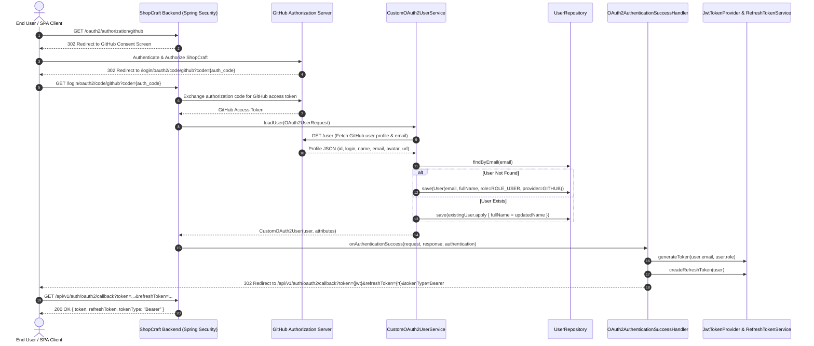

# Day 07: OAuth2 Social Login & OAuth2-to-JWT Bridge Pattern

Welcome to **Day 07** of the ShopCraft Backend Master Course. In Days 06 Part 1 & Part 2, you built a robust stateless authentication system using **JSON Web Tokens (JWT)**, Role-Based Access Control (RBAC), and persistent **Refresh Token Rotation (RTR)**.

In Day 07, you will integrate third-party identity providers by mastering **OAuth 2.0 Social Login with GitHub**, automatic user provisioning in PostgreSQL, and the **OAuth2-to-JWT Bridge Pattern**.

---

## 🎯 Learning Objectives

By the end of this module, you will master:
1. **OAuth 2.0 Authorization Code Grant Flow**: The exact 4-step sequence between the User, Client Application, Authorization Server (GitHub), and Resource Server.
2. **Spring Security OAuth2 Client**: Utilizing `spring-boot-starter-security-oauth2-client` for seamless provider registration, redirect generation, and token exchange.
3. **User Auto-Provisioning (`CustomOAuth2UserService`)**: Extending `DefaultOAuth2UserService` to extract normalized claims (`OAuth2UserInfo`) from GitHub and automatically synchronize or create `User` accounts in PostgreSQL.
4. **The OAuth2-to-JWT Bridge Pattern**: Why SPAs and mobile apps cannot easily use server-side OAuth2 session cookies, and how `OAuth2AuthenticationSuccessHandler` bridges OAuth2 redirects into stateless JWT access tokens and long-lived refresh tokens.
5. **Multi-Provider Architecture**: Designing extensible `OAuth2UserInfo` abstractions to support multiple providers (GitHub, Google, etc.) without coupling business logic to provider-specific JSON schemas.

---

## 🔬 Architecture & Sequence Flow

### 1. OAuth2-to-JWT Bridge Sequence Flow


---

## 🛠️ Step-by-Step Implementation Guide

### Step 1: Provider Claim Abstraction
- Open [OAuth2UserInfo.kt](file:///Users/platinum/IdeaProjects/spring-boot-kotlin-course/src/main/kotlin/com/example/shopcraft/auth/oauth2/OAuth2UserInfo.kt) and [GitHubOAuth2UserInfo.kt](file:///Users/platinum/IdeaProjects/spring-boot-kotlin-course/src/main/kotlin/com/example/shopcraft/auth/oauth2/GitHubOAuth2UserInfo.kt).
- Extract `id`, `name`, `email` (with fallback to `${login}@users.noreply.github.com`), and `imageUrl`.
- Use [OAuth2UserInfoFactory.kt](file:///Users/platinum/IdeaProjects/spring-boot-kotlin-course/src/main/kotlin/com/example/shopcraft/auth/oauth2/OAuth2UserInfoFactory.kt) to resolve the parser dynamically.

### Step 2: User Auto-Provisioning
- Open [CustomOAuth2UserService.kt](file:///Users/platinum/IdeaProjects/spring-boot-kotlin-course/src/main/kotlin/com/example/shopcraft/auth/oauth2/CustomOAuth2UserService.kt).
- Extend `DefaultOAuth2UserService`.
- In `loadUser(userRequest: OAuth2UserRequest)`:
  - Delegate to `super.loadUser(userRequest)` to fetch provider attributes.
  - Check if a user with `email` exists in `UserRepository`.
  - If existing: update profile metadata (`fullName`).
  - If new: create and save a new `User` entity with `Role.ROLE_USER` and `provider = GITHUB`.
  - Wrap and return a `CustomOAuth2User` principal.

### Step 3: The OAuth2-to-JWT Bridge Handler
- Open [OAuth2AuthenticationSuccessHandler.kt](file:///Users/platinum/IdeaProjects/spring-boot-kotlin-course/src/main/kotlin/com/example/shopcraft/auth/oauth2/OAuth2AuthenticationSuccessHandler.kt).
- Extend `SimpleUrlAuthenticationSuccessHandler`.
- In `determineTargetUrl(...)`:
  - Extract the authenticated `CustomOAuth2User`.
  - Generate an internal ShopCraft JWT access token (15m) using `jwtTokenProvider.generateToken()`.
  - Generate a persistent refresh token (7d) using `refreshTokenService.createRefreshToken()`.
  - Build the target URL pointing to `oAuth2Properties.authorizedRedirectUri` with query params: `token`, `refreshToken`, `tokenType=Bearer`.
  - Redirect the user agent.

### Step 4: SecurityFilterChain & Callback Integration
- Open [SecurityConfig.kt](file:///Users/platinum/IdeaProjects/spring-boot-kotlin-course/src/main/kotlin/com/example/shopcraft/common/config/SecurityConfig.kt).
- Configure `.oauth2Login { ... }` with `customOAuth2UserService` and `oauth2AuthenticationSuccessHandler`.
- Open [AuthController.kt](file:///Users/platinum/IdeaProjects/spring-boot-kotlin-course/src/main/kotlin/com/example/shopcraft/auth/controller/AuthController.kt).
- Add `@GetMapping("/oauth2/callback")` to handle the redirect and return minted tokens as JSON.

---

## 🚀 Verification Commands

Run the complete test suite:
```bash
./gradlew test --rerun-tasks
```

Run only OAuth2 unit and slice tests:
```bash
./gradlew test --tests "com.example.shopcraft.auth.oauth2.CustomOAuth2UserServiceTest"
./gradlew test --tests "com.example.shopcraft.auth.oauth2.OAuth2AuthenticationSuccessHandlerTest"
```

Run full OAuth2 integration test:
```bash
./gradlew test --tests "com.example.shopcraft.auth.oauth2.OAuth2IntegrationTest"
```

---

## 🧪 Testing OAuth2: Automated & Live Verification Guide

You can verify the OAuth2 implementation using both automated test fixtures and live end-to-end browser execution.

### Method 1: Automated Test Suite (Offline / CI-Friendly)

No external credentials or GitHub accounts are required. All identity claims and authorization redirects are simulated using Spring Security test fixtures and Mockito.

1. **Run all OAuth2 tests**:
   ```bash
   ./gradlew test --tests "com.example.shopcraft.auth.oauth2.*"
   ```

2. **What each test suite verifies**:
   - [`CustomOAuth2UserServiceTest`](file:///Users/platinum/IdeaProjects/spring-boot-kotlin-course/src/test/kotlin/com/example/shopcraft/auth/oauth2/CustomOAuth2UserServiceTest.kt):
     - Mocks GitHub profile response and asserts new user auto-provisioning with `ROLE_USER` and `provider = "GITHUB"`.
     - Validates profile synchronization for returning users without creating duplicate accounts.
     - Verifies private email fallback to `${login}@users.noreply.github.com`.
     - Ensures unsupported providers (e.g. Facebook) are rejected with `OAuth2AuthenticationException`.
   - [`OAuth2AuthenticationSuccessHandlerTest`](file:///Users/platinum/IdeaProjects/spring-boot-kotlin-course/src/test/kotlin/com/example/shopcraft/auth/oauth2/OAuth2AuthenticationSuccessHandlerTest.kt):
     - Asserts that upon successful authentication, the handler mints a 15-minute access token and a 7-day refresh token, redirecting the browser to `/api/v1/auth/oauth2/callback?token=...&refreshToken=...`.
   - [`OAuth2IntegrationTest`](file:///Users/platinum/IdeaProjects/spring-boot-kotlin-course/src/test/kotlin/com/example/shopcraft/auth/oauth2/OAuth2IntegrationTest.kt):
     - Asserts `/oauth2/authorization/github` initiates the 302 redirect to GitHub's consent screen.
     - Asserts `/api/v1/auth/oauth2/callback` returns HTTP 200 with the minted bearer tokens.
     - Validates that tokens minted from an OAuth2 user authenticate protected requests to `GET /api/v1/auth/me`.

---

### Method 2: Live End-to-End Testing (With Real GitHub OAuth App)

To test the complete live flow in the browser with real GitHub credentials:

#### Step 1: Register an OAuth App on GitHub
1. Navigate to: **GitHub** $\rightarrow$ **Settings** $\rightarrow$ **Developer settings** $\rightarrow$ **OAuth Apps** $\rightarrow$ **New OAuth App** (direct link: https://github.com/settings/applications/new).
2. Configure the application:
   - **Application name**: `ShopCraft Local`
   - **Homepage URL**: `http://localhost:8080`
   - **Authorization callback URL**: `http://localhost:8080/login/oauth2/code/github`
3. Click **Register application**.
4. Note your **Client ID**, click **Generate a new client secret**, and copy the **Client Secret**.

#### Step 2: Launch ShopCraft with GitHub Environment Variables
Run the backend with your credentials passed as environment variables (no source edits required):

```bash
export SPRING_SECURITY_OAUTH2_CLIENT_REGISTRATION_GITHUB_CLIENT_ID="your_client_id_here"
export SPRING_SECURITY_OAUTH2_CLIENT_REGISTRATION_GITHUB_CLIENT_SECRET="your_client_secret_here"

./gradlew bootRun
```

#### Step 3: Trigger the Login Flow in Your Browser
1. In your browser, open:
   ```text
   http://localhost:8080/oauth2/authorization/github
   ```
2. You will see GitHub's consent prompt: *"Authorize ShopCraft Local to access your account"*.
3. Click **Authorize**.
4. GitHub redirects back to ShopCraft:
   ```text
   http://localhost:8080/login/oauth2/code/github?code=...
   ```
5. [`CustomOAuth2UserService`](file:///Users/platinum/IdeaProjects/spring-boot-kotlin-course/src/main/kotlin/com/example/shopcraft/auth/oauth2/CustomOAuth2UserService.kt) auto-provisions your GitHub profile in PostgreSQL / H2.
6. [`OAuth2AuthenticationSuccessHandler`](file:///Users/platinum/IdeaProjects/spring-boot-kotlin-course/src/main/kotlin/com/example/shopcraft/auth/oauth2/OAuth2AuthenticationSuccessHandler.kt) mints internal JWT access & refresh tokens and redirects to:
   ```text
   http://localhost:8080/api/v1/auth/oauth2/callback?token=eyJhbGci...&refreshToken=...&tokenType=Bearer
   ```
7. The browser renders the JSON payload:
   ```json
   {
     "token": "eyJhbGciOiJIUzI1NiJ9...",
     "refreshToken": "7c12f3e8-4b2a-...",
     "tokenType": "Bearer",
     "message": "OAuth2 authentication successful. Bearer tokens minted."
   }
   ```

#### Step 4: Verify the Minted Token on Protected Endpoints

Using the `token` and `refreshToken` received:

```bash
# 1. Access protected profile (verifies GitHub account was auto-provisioned)
curl -H "Authorization: Bearer <TOKEN_FROM_BROWSER>" http://localhost:8080/api/v1/auth/me

# 2. Test Refresh Token Rotation using the OAuth2-minted refresh token
curl -X POST http://localhost:8080/api/v1/auth/refresh \
  -H "Content-Type: application/json" \
  -d '{"refreshToken": "<REFRESH_TOKEN_FROM_BROWSER>"}'
```

