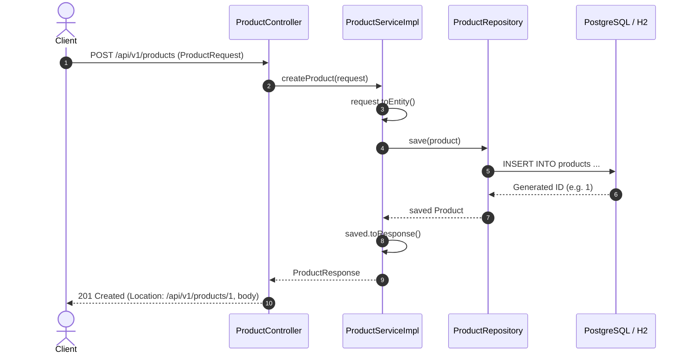

# Day 01: Spring Boot with Kotlin Foundations

Welcome to **Day 01** of the Spring Boot with Kotlin Master Course! Today, you lay the foundational architecture for **ShopCraft**, our high-performance e-commerce backend engine.

---

## 🎯 Learning Objectives

By the end of this module, you will be able to:
1. **Configure Spring Boot with Kotlin**: Understand the Gradle Kotlin DSL (`build.gradle.kts`), compiler plugins (`kotlin-spring`, `kotlin-jpa`), and JDK 21 LTS toolchain.
2. **Apply Idiomatic Dependency Injection**: Structure controllers, services, and repositories using constructor injection with immutable `val` properties, eliminating `@Autowired` and `lateinit var`.
3. **Master JPA Entity vs. DTO Design**: Articulate why JPA entities must **never** be Kotlin `data class`es and how to design clean, immutable DTOs with mapping functions.
4. **Leverage Spring Data Kotlin Extensions**: Use idiomatic extensions like `findByIdOrNull()` to eliminate Java `Optional<T>` boilerplate.
5. **Implement REST Creation Semantics**: Expose REST endpoints returning `201 Created` with a standard RFC `Location` header (`/api/v1/products/{id}`).
6. **Practice Test-Driven Development (TDD)**: Verify your work using BDD Given-When-Then test suites across unit, slice, and repository layers.

---

## 🧠 Core Theory & Deep Dive

### 1. Kotlin & Spring Boot: The Runtime Interplay

Kotlin is a concise, statically typed language targeting the JVM. However, Spring Framework and JPA (Hibernate) were originally architected around Java conventions:
- Spring heavily relies on **CGLIB proxies**, requiring classes and methods to be non-final (open).
- Hibernate requires entity classes to have a **no-argument constructor** for reflection and proxy generation.

In Kotlin, classes and methods are **final by default**, and primary constructors with properties do not generate zero-arg constructors by default.

To bridge this gap without cluttering your code with `open` keywords or fake constructors, Spring Boot uses two Kotlin compiler plugins:

```kotlin
// build.gradle.kts
plugins {
    kotlin("jvm") version "2.3.21"
    kotlin("plugin.spring") version "2.3.21" // Applies "all-open" to @Component, @Configuration, @Transactional, etc.
    kotlin("plugin.jpa") version "2.3.21"    // Applies "no-arg" to @Entity, @MappedSuperclass, @Embeddable
}
```

- **`kotlin-spring` (all-open)**: Automatically marks any class annotated with `@Component`, `@Async`, `@Transactional`, `@Cacheable`, `@SpringBootTest`, or `@Configuration` as `open` at the bytecode level.
- **`kotlin-jpa` (no-arg)**: Synthesizes a bytecode-level zero-argument constructor for `@Entity` classes so Hibernate can instantiate them via reflection without requiring manual boilerplate.

---

### 2. Constructor Injection vs. Field Injection

In Java, developers historically used field injection (`@Autowired private ProductRepository repository;`). In Kotlin, field injection requires `lateinit var`:

```kotlin
// ❌ ANTI-PATTERN: Mutable state, tightly coupled, impossible to test cleanly without Spring context
@Service
class ProductService {
    @Autowired
    private lateinit var productRepository: ProductRepository
}
```

#### Why `lateinit var` is an Anti-Pattern for Dependencies:
1. **Mutates State**: `var` can be reassigned at runtime, breaking immutability.
2. **Hidden Dependencies**: Object instantiation hides requirements, making pure unit testing difficult.
3. **Null-Safety Violation**: If accessed before injection, it throws a runtime `UninitializedPropertyAccessException`.

#### The Idiomatic Kotlin Solution:
Use **primary constructor injection** with immutable `val` properties:

```kotlin
// ✅ IDIOMATIC KOTLIN: Immutable, clear contract, effortlessly testable with mockito-kotlin
@Service
@Transactional(readOnly = true)
class ProductServiceImpl(
    private val productRepository: ProductRepository
) : ProductService { ... }
```

Spring automatically injects parameters of single constructors without requiring `@Autowired`.

---

### 3. The JPA Entity vs. DTO Data Class Dilemma

One of the most common pitfalls when developers transition from Java to Kotlin is declaring JPA entities as `data class`:

```kotlin
// ❌ CRITICAL ANTI-PATTERN: NEVER make JPA Entities a data class!
@Entity
data class Product(
    @Id val id: Long? = null,
    var name: String
)
```

#### Why JPA Entities Must NOT be `data class`:

| Feature of `data class` | Conflict with JPA / Hibernate |
| :--- | :--- |
| **Generated `equals()` & `hashCode()`** | Evaluates all constructor properties. Before an entity is saved, its `id` is `null`. If properties mutate, its hash code changes while inside a Hibernate Set/Map, corrupting the First-Level Cache. Furthermore, Hibernate proxies fail field-level equality checks. |
| **Generated `copy()`** | `product.copy(name = "New")` creates a brand-new instance in memory that is **completely detached** from Hibernate's Persistence Context. Hibernate will not detect its dirty state. |
| **Generated `toString()`** | Recursively traverses every property. In entities with `@ManyToOne` or `@OneToMany` relationships, this triggers unexpected SQL queries (`LazyInitializationException`) or infinite loops (`StackOverflowError`). |

#### The Solution:
- Use standard `class` for JPA entities.
- Implement `equals()` and `hashCode()` based strictly on database identity (`id != null && id == other.id`).
- Reserve immutable `data class` exclusively for **Data Transfer Objects (DTOs)**:

```kotlin
// ✅ Proper JPA Entity
@Entity
@Table(name = "products")
class Product(
    @Id
    @GeneratedValue(strategy = GenerationType.IDENTITY)
    val id: Long? = null,

    @Column(nullable = false, unique = true)
    var sku: String,

    @Column(nullable = false)
    var name: String,

    @Column(nullable = false)
    var price: BigDecimal,

    @Column(nullable = false)
    var stockQuantity: Int,

    @Enumerated(EnumType.STRING)
    var status: ProductStatus = ProductStatus.ACTIVE
) {
    override fun equals(other: Any?): Boolean {
        if (this === other) return true
        if (other !is Product) return false
        return id != null && id == other.id
    }

    override fun hashCode(): Int = id?.hashCode() ?: 0
}

// ✅ Proper DTO: Immutable data class
data class ProductResponse(
    val id: Long,
    val sku: String,
    val name: String,
    val price: BigDecimal,
    val stockQuantity: Int,
    val status: ProductStatus
)
```

---

### 4. Spring Data Kotlin Extensions: `findByIdOrNull()`

In Java, `CrudRepository.findById(id)` returns `Optional<T>`. In Kotlin, working with `Optional` is verbose and unidiomatic (`optional.orElseThrow(...)`).

Spring Data provides first-class Kotlin extensions in `org.springframework.data.repository.findByIdOrNull`:

```kotlin
import org.springframework.data.repository.findByIdOrNull

// Java Style (Clunky in Kotlin)
val product = productRepository.findById(id).orElseThrow { ProductNotFoundException(id) }

// Idiomatic Kotlin Style (Clean Elvis Operator)
val product = productRepository.findByIdOrNull(id) ?: throw ProductNotFoundException(id)
```

---

## 🏛️ Architecture Overview



---

## 🔨 Step-by-Step Implementation Guide

If you are on the **`day-01-spring-boot-kotlin-starter`** branch, follow these 9 steps to implement the exercises:

### Step 1: Annotate the `Product` JPA Entity
- File: `src/main/kotlin/com/example/shopcraft/product/entity/Product.kt`
- Annotate the class with `@Entity` and `@Table(name = "products")`.
- Annotate the primary key `id` with `@Id` and `@GeneratedValue(strategy = GenerationType.IDENTITY)`.
- Configure column mappings:
  - `sku`: `@Column(nullable = false, unique = true, length = 64)`.
  - `name`: `@Column(nullable = false, length = 255)`.
  - `description`: `@Column(columnDefinition = "TEXT")`.
  - `price`: `@Column(nullable = false, precision = 12, scale = 2)`.
  - `stockQuantity`: `@Column(nullable = false)`.
  - `status`: `@Enumerated(EnumType.STRING)` and `@Column(nullable = false, length = 32)`.
  - `createdAt`: `@Column(nullable = false, updatable = false)`.
  - `updatedAt`: `@Column(nullable = false)`.

### Step 2: Implement `toResponse()` on `Product`
- File: `src/main/kotlin/com/example/shopcraft/product/entity/Product.kt`
- Map this entity instance properties into an immutable `ProductResponse` DTO instance.

### Step 3: Implement `toEntity()` on `ProductRequest`
- File: `src/main/kotlin/com/example/shopcraft/product/dto/ProductDtos.kt`
- Construct and return a new `Product` JPA entity populated from this request DTO attributes.

### Step 4: Implement `createProduct` in `ProductServiceImpl`
- File: `src/main/kotlin/com/example/shopcraft/product/service/ProductServiceImpl.kt`
- Convert the incoming `ProductRequest` using `request.toEntity()`.
- Persist the entity via `productRepository.save(product)`.
- Convert and return the resulting entity using `saved.toResponse()`.

### Step 5: Implement `getProductById` in `ProductServiceImpl`
- File: `src/main/kotlin/com/example/shopcraft/product/service/ProductServiceImpl.kt`
- Retrieve the entity using `productRepository.findByIdOrNull(id)`.
- If the result is null, throw a `ProductNotFoundException(id)` using the Elvis operator (`?:`).
- Convert and return the entity via `.toResponse()`.

### Step 6: Implement `getAllProducts` in `ProductServiceImpl`
- File: `src/main/kotlin/com/example/shopcraft/product/service/ProductServiceImpl.kt`
- Call `productRepository.findAll()`.
- Map each entity to its DTO counterpart using `.map { it.toResponse() }`.

### Step 7: Implement `createProduct` in `ProductController`
- File: `src/main/kotlin/com/example/shopcraft/product/controller/ProductController.kt`
- Call `productService.createProduct(request)` to create the catalog item.
- Construct an RFC-compliant URI: `URI.create("/api/v1/products/${created.id}")`.
- Return `ResponseEntity.created(location).body(created)` with HTTP status `201 Created`.

### Step 8: Implement `getProductById` in `ProductController`
- File: `src/main/kotlin/com/example/shopcraft/product/controller/ProductController.kt`
- Call `productService.getProductById(id)`.
- Return `ResponseEntity.ok(product)` with HTTP status `200 OK`.

### Step 9: Implement `getAllProducts` in `ProductController`
- File: `src/main/kotlin/com/example/shopcraft/product/controller/ProductController.kt`
- Call `productService.getAllProducts()`.
- Return `ResponseEntity.ok(products)` with HTTP status `200 OK`.

---

## 🧪 Verification & Automated Testing

All tests in this course adhere to the **Given-When-Then** BDD testing convention:
- Function names use descriptive Kotlin backticks (e.g. `` `given valid product request, when createProduct, then persists entity and returns response` ``).
- Test bodies are cleanly partitioned into Given, When, and Then phases using blank lines.

Run the automated test suite from your terminal:
```bash
./gradlew test
```

### Expected Output:
- **On `day-01-spring-boot-kotlin-solution`**:
  All 11 tests pass with **100% green**:
  - `ShopcraftApplicationTests` (Context loads)
  - `ProductServiceTest` (4 unit tests)
  - `ProductControllerTest` (3 web slice tests)
  - `ProductRepositoryTest` (3 data slice tests)
- **On `day-01-spring-boot-kotlin-starter`**:
  Baseline context loads test passes; Day 01 exercise tests fail with `NotImplementedError` until you complete Steps 1 through 4.

---

## 🚀 Running the Application & Manual Testing

1. **Start the application**:
   ```bash
   ./gradlew bootRun
   ```

2. **Execute the automated cURL test script**:
   ```bash
   chmod +x requests/day01.curl.sh
   ./requests/day01.curl.sh
   ```

3. **Or execute the HTTP requests in IntelliJ IDEA**:
   Open `requests/day01.http` and click the green play button next to each request.
